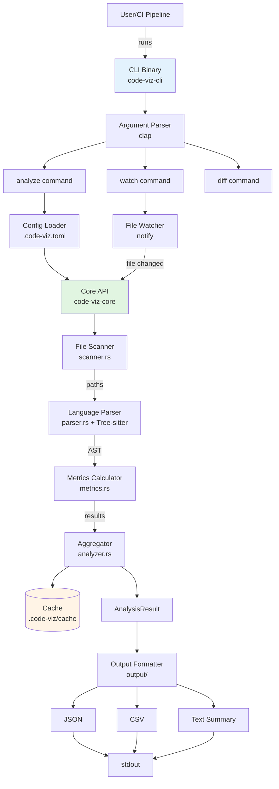

# Design Document - MVP (CLI-First)

## Overview

The Code-Viz MVP is architected as a **dual-crate Rust project**: a library crate (`code-viz-core`) containing pure analysis logic, and a binary crate (`code-viz-cli`) providing the command-line interface. This separation enables:

- **Library-first design**: Core analysis engine is CLI-agnostic and can be embedded in future GUI applications, web servers, or language server protocols
- **Fast iteration**: CLI changes (argument parsing, output formatting) don't require recompiling the analysis engine
- **Testability**: Pure functions in library crate are easy to unit test without mocking I/O

The system follows a **pipeline architecture**:
```
File Discovery → Parsing (Tree-sitter) → Metrics Calculation → Output Formatting
```

Each stage is independently testable and can be parallelized using Rayon.

## Steering Document Alignment

### Technical Standards (tech.md)

- **Rust 1.75+**: Primary language for both crates
- **Tree-sitter 0.20+**: Multi-language parsing with incremental capabilities
- **Performance Targets**:
  - Startup: <50ms for `--help`
  - Analysis: <30s for 100K files (using rayon for parallelism)
  - Watch mode: <100ms incremental updates (leveraging Tree-sitter's incremental parsing)
- **Compilation Acceleration**:
  - Mold linker configured in `.cargo/config.toml`
  - Sccache for shared compilation cache
  - Justfile for dev/test/build recipes
- **Testing**: cargo-nextest for parallel test execution, insta for snapshot testing
- **Logging**: tracing crate with structured JSON logs to stderr

### Project Structure (structure.md)

```
code-viz/
├── crates/
│   ├── code-viz-core/          # Library crate (analysis engine)
│   │   ├── src/
│   │   │   ├── lib.rs          # Public API exports
│   │   │   ├── scanner.rs      # File discovery with exclusions
│   │   │   ├── parser.rs       # Tree-sitter wrapper (trait-based)
│   │   │   ├── metrics.rs      # LOC and function counting
│   │   │   ├── analyzer.rs     # Orchestrates scan → parse → metrics
│   │   │   ├── models.rs       # Data structures (FileMetrics, AnalysisResult)
│   │   │   └── cache.rs        # Disk-based caching (.code-viz/cache)
│   │   ├── Cargo.toml
│   │   └── tests/
│   │       ├── integration_test.rs
│   │       └── snapshots/      # Insta snapshot files
│   │
│   └── code-viz-cli/           # Binary crate (CLI interface)
│       ├── src/
│       │   ├── main.rs         # Entry point, command dispatcher
│       │   ├── commands/
│       │   │   ├── mod.rs
│       │   │   ├── analyze.rs  # `analyze` command logic
│       │   │   ├── watch.rs    # `watch` command with notify integration
│       │   │   ├── diff.rs     # `diff` command for comparing reports
│       │   │   └── config.rs   # `config init` command
│       │   ├── output/
│       │   │   ├── mod.rs
│       │   │   ├── json.rs     # JSON formatter
│       │   │   ├── csv.rs      # CSV formatter
│       │   │   └── text.rs     # Human-readable text formatter
│       │   └── config_loader.rs # .code-viz.toml parsing
│       ├── Cargo.toml
│       └── tests/
│           └── cli_tests.rs    # Integration tests with temp dirs
│
├── .cargo/
│   └── config.toml             # Linker configuration (mold)
├── Justfile                    # Task runner recipes
├── Cargo.toml                  # Workspace manifest
└── README.md
```

**Naming Conventions**:
- Rust files: `snake_case.rs`
- Structs/Enums: `PascalCase`
- Functions: `snake_case`
- Constants: `SCREAMING_SNAKE_CASE`

**Module Boundaries**:
- `code-viz-core` has NO dependencies on `clap`, `notify`, or any CLI-specific crates
- `code-viz-cli` depends on `code-viz-core` but not vice versa
- Communication via public API defined in `code-viz-core/src/lib.rs`

## Code Reuse Analysis

Since this is a greenfield project, there's no existing codebase to leverage. However, we establish **reusable patterns** from the start:

### Foundation for Future Features

- **`parser.rs` trait system**: Designed to support adding new languages (Go, Java, C++) without modifying core logic
  ```rust
  pub trait LanguageParser {
      fn parse(&self, source: &str) -> Result<ParseTree, ParseError>;
      fn count_functions(&self, tree: &ParseTree) -> usize;
  }
  ```

- **`output/` formatters**: Implementing `MetricsFormatter` trait allows adding new formats (Prometheus, XML) as plugins
  ```rust
  pub trait MetricsFormatter {
      fn format(&self, result: &AnalysisResult) -> Result<String, FormatterError>;
  }
  ```

- **`cache.rs` abstraction**: Designed to swap backends (sled → SQLite → rocksdb) without changing analyzer logic

### Integration Points

- **Git integration (future)**: `AnalysisResult` includes `last_modified` timestamp; can later correlate with Git commits
- **GUI integration (future)**: CLI can output newline-delimited JSON stream that GUI consumes via subprocess
- **LSP integration (future)**: Library crate can be embedded in language server for real-time diagnostics

## Architecture

### System Architecture Diagram



### Modular Design Principles

- **Single File Responsibility**:
  - `scanner.rs`: File discovery and filtering (glob patterns, exclusions)
  - `parser.rs`: Tree-sitter abstraction (language-agnostic interface)
  - `metrics.rs`: Metric calculation algorithms (LOC, function counting)
  - `analyzer.rs`: Orchestration (scan → parse → metrics → aggregate)

- **Component Isolation**:
  - Each component exposes a minimal public API (1-3 functions)
  - Internal helpers are private (`pub(crate)` for cross-module sharing within crate)
  - No global state; all functions are pure or take explicit dependencies

- **Service Layer Separation**:
  - **Data Access**: `cache.rs` abstracts disk I/O
  - **Business Logic**: `analyzer.rs`, `metrics.rs` are pure computation
  - **Presentation**: `output/` modules handle formatting concerns

## Components and Interfaces

### Component 1: File Scanner (`scanner.rs`)

- **Purpose**: Discover all files in a directory tree, respecting exclusion patterns
- **Public API**:
  ```rust
  pub fn scan_directory(
      path: &Path,
      exclude_patterns: &[String],
  ) -> Result<Vec<PathBuf>, ScanError>;
  ```
- **Dependencies**:
  - `std::fs` for directory traversal
  - `globset` crate for pattern matching
- **Algorithm**:
  1. Use `walkdir` crate for recursive traversal
  2. Apply exclusion patterns as early filter (skip entire `node_modules/` tree)
  3. Filter by file extension (`.rs`, `.ts`, `.js`, `.py`)
  4. Return sorted list of paths (alphabetical for deterministic output)
- **Performance**: Parallelized using `rayon::par_iter` for multi-core machines

### Component 2: Language Parser (`parser.rs`)

- **Purpose**: Abstract Tree-sitter parsing for multiple languages
- **Public API**:
  ```rust
  pub trait LanguageParser: Send + Sync {
      fn language(&self) -> &str; // "rust", "typescript", etc.
      fn parse(&self, source: &str) -> Result<Tree, ParseError>;
      fn count_functions(&self, tree: &Tree) -> usize;
  }

  pub struct RustParser { /* Tree-sitter instance */ }
  impl LanguageParser for RustParser { /* ... */ }

  pub struct TypeScriptParser { /* Tree-sitter instance */ }
  impl LanguageParser for TypeScriptParser { /* ... */ }

  pub fn get_parser(language: &str) -> Result<Box<dyn LanguageParser>, ParserError>;
  ```
- **Dependencies**:
  - `tree-sitter` core library
  - `tree-sitter-rust`, `tree-sitter-typescript`, etc. (language grammars)
- **Implementation Notes**:
  - Each parser implementation wraps a `tree_sitter::Parser` with language-specific grammar
  - Function counting uses Tree-sitter queries (S-expression patterns):
    ```scheme
    ;; Rust query
    (function_item) @function
    (impl_item (function_item)) @method
    ```
  - Parsers are cached in a `OnceCell` for reuse across files

### Component 3: Metrics Calculator (`metrics.rs`)

- **Purpose**: Calculate code metrics from parsed syntax trees and raw source
- **Public API**:
  ```rust
  pub struct FileMetrics {
      pub path: PathBuf,
      pub language: String,
      pub loc: usize,              // Lines of Code (excluding comments/blanks)
      pub size_bytes: u64,
      pub function_count: usize,
      pub last_modified: SystemTime,
  }

  pub fn calculate_metrics(
      path: &Path,
      source: &str,
      parser: &dyn LanguageParser,
  ) -> Result<FileMetrics, MetricsError>;
  ```
- **Dependencies**: Parser component, `std::fs::metadata` for file info
- **Algorithm**:
  1. **LOC Calculation**:
     - Parse source with Tree-sitter
     - Traverse AST, identify comment nodes
     - Count non-blank lines that don't overlap with comment byte ranges
  2. **Function Counting**: Delegate to `parser.count_functions(tree)`
  3. **File Metadata**: Extract size and modified time from `fs::metadata`
- **Edge Cases**:
  - Mixed-line comments: `code(); // comment` counts as 1 LOC
  - Parse errors: Return `MetricsError::ParseFailed`, caller continues with other files

### Component 4: Analysis Orchestrator (`analyzer.rs`)

- **Purpose**: High-level API that orchestrates scan → parse → metrics pipeline
- **Public API**:
  ```rust
  pub struct AnalysisResult {
      pub summary: Summary,
      pub files: Vec<FileMetrics>,
      pub timestamp: SystemTime,
  }

  pub struct Summary {
      pub total_files: usize,
      pub total_loc: usize,
      pub total_functions: usize,
      pub largest_files: Vec<PathBuf>, // Top 10 by LOC
  }

  pub struct AnalysisConfig {
      pub exclude_patterns: Vec<String>,
      pub use_cache: bool,
  }

  pub fn analyze(
      root: &Path,
      config: &AnalysisConfig,
  ) -> Result<AnalysisResult, AnalysisError>;
  ```
- **Dependencies**: Scanner, Parser, Metrics, Cache
- **Flow**:
  1. Call `scanner::scan_directory(root, config.exclude_patterns)`
  2. For each file (parallelized with `rayon::par_iter`):
     - Check cache: if file mtime unchanged, use cached metrics
     - Else: read source, parse, calculate metrics
     - Store in cache
  3. Aggregate metrics into `Summary`
  4. Return `AnalysisResult`
- **Parallelism**: Uses `rayon::ThreadPoolBuilder` with CPU core count

### Component 5: Cache Layer (`cache.rs`)

- **Purpose**: Persist analysis results to disk for fast re-analysis
- **Public API**:
  ```rust
  pub struct DiskCache {
      path: PathBuf, // .code-viz/cache
  }

  impl DiskCache {
      pub fn new(cache_dir: PathBuf) -> Result<Self, CacheError>;

      pub fn get(&self, file_path: &Path) -> Option<FileMetrics>;

      pub fn set(&self, metrics: &FileMetrics) -> Result<(), CacheError>;

      pub fn invalidate(&self, file_path: &Path) -> Result<(), CacheError>;
  }
  ```
- **Dependencies**: `serde` for serialization, `bincode` for binary format
- **Storage Format**:
  - Key: SHA-256 hash of `file_path`
  - Value: `bincode`-serialized `FileMetrics` struct
  - File: `.code-viz/cache/<hash>.bin`
- **Cache Invalidation**: Compare file's `last_modified` time; if different, ignore cache

### Component 6: Output Formatters (`output/`)

- **Purpose**: Convert `AnalysisResult` to various output formats
- **Public API**:
  ```rust
  pub trait MetricsFormatter {
      fn format(&self, result: &AnalysisResult) -> Result<String, FormatterError>;
  }

  pub struct JsonFormatter;
  impl MetricsFormatter for JsonFormatter { /* serde_json */ }

  pub struct CsvFormatter;
  impl MetricsFormatter for CsvFormatter { /* csv crate */ }

  pub struct TextFormatter;
  impl MetricsFormatter for TextFormatter { /* pretty tables */ }
  ```
- **Dependencies**: `serde_json`, `csv`, `prettytable-rs`
- **Implementations**:
  - **JSON**: Serialize entire `AnalysisResult` struct
  - **CSV**: Flatten `files` array to rows (path, language, loc, functions, size_bytes)
  - **Text**: ASCII table with summary + top 10 largest files

### Component 7: Watch Mode (`commands/watch.rs`)

- **Purpose**: Monitor file system for changes and trigger incremental re-analysis
- **Public API** (internal to CLI, not in lib):
  ```rust
  pub fn run_watch(
      root: PathBuf,
      config: AnalysisConfig,
      formatter: Box<dyn MetricsFormatter>,
  ) -> Result<(), WatchError>;
  ```
- **Dependencies**: `notify` crate (file watcher), `code-viz-core::analyze`
- **Flow**:
  1. Perform initial analysis, print results
  2. Create `notify::RecommendedWatcher` for `root` directory
  3. On file event:
     - Debounce: collect events for 100ms
     - Filter: only re-analyze changed files (not entire tree)
     - Call `analyze` on subset of files
     - Print updated metrics to stdout
  4. Run until Ctrl+C (SIGINT)
- **Output Format**: Newline-delimited JSON for `--format json` mode

## Data Models

### FileMetrics

```rust
use serde::{Deserialize, Serialize};
use std::path::PathBuf;
use std::time::SystemTime;

#[derive(Debug, Clone, Serialize, Deserialize, PartialEq)]
pub struct FileMetrics {
    /// Relative path from repository root
    pub path: PathBuf,

    /// Programming language ("rust", "typescript", "python", etc.)
    pub language: String,

    /// Lines of code (excluding comments and blank lines)
    pub loc: usize,

    /// File size in bytes
    pub size_bytes: u64,

    /// Number of functions/methods
    pub function_count: usize,

    /// Last modified timestamp (for cache invalidation)
    pub last_modified: SystemTime,
}
```

### AnalysisResult

```rust
#[derive(Debug, Clone, Serialize, Deserialize)]
pub struct AnalysisResult {
    /// Aggregated summary statistics
    pub summary: Summary,

    /// Per-file metrics
    pub files: Vec<FileMetrics>,

    /// When this analysis was performed
    pub timestamp: SystemTime,
}

#[derive(Debug, Clone, Serialize, Deserialize)]
pub struct Summary {
    /// Total number of files analyzed
    pub total_files: usize,

    /// Total lines of code across all files
    pub total_loc: usize,

    /// Total functions across all files
    pub total_functions: usize,

    /// Top 10 largest files by LOC (sorted descending)
    pub largest_files: Vec<PathBuf>,
}
```

### AnalysisConfig

```rust
#[derive(Debug, Clone)]
pub struct AnalysisConfig {
    /// Glob patterns to exclude (e.g., "node_modules/**")
    pub exclude_patterns: Vec<String>,

    /// Whether to use disk cache for unchanged files
    pub use_cache: bool,
}

impl Default for AnalysisConfig {
    fn default() -> Self {
        Self {
            exclude_patterns: vec![
                "node_modules/**".into(),
                "target/**".into(),
                ".git/**".into(),
                "dist/**".into(),
                "build/**".into(),
            ],
            use_cache: true,
        }
    }
}
```

### .code-viz.toml Config File

```toml
[analysis]
# Glob patterns to exclude
exclude = [
    "**/generated/**",
    "**/*.test.ts",
]

[output]
# Default output format: "json", "csv", or "text"
format = "json"

[cache]
# Enable or disable caching
enabled = true
```

Parsed using `toml` crate into:
```rust
#[derive(Debug, Deserialize)]
pub struct ConfigFile {
    pub analysis: Option<AnalysisConfigSection>,
    pub output: Option<OutputConfigSection>,
    pub cache: Option<CacheConfigSection>,
}
```

## Error Handling

Follows Rust best practices: use `Result<T, E>` everywhere, define custom error types with `thiserror`.

### Error Types Hierarchy

```rust
use thiserror::Error;

#[derive(Error, Debug)]
pub enum AnalysisError {
    #[error("Failed to scan directory: {0}")]
    ScanFailed(#[from] ScanError),

    #[error("Parse error in {path}: {source}")]
    ParseFailed {
        path: PathBuf,
        source: ParseError,
    },

    #[error("Cache error: {0}")]
    CacheFailed(#[from] CacheError),

    #[error("I/O error: {0}")]
    IoError(#[from] std::io::Error),
}

#[derive(Error, Debug)]
pub enum ParseError {
    #[error("Unsupported language: {0}")]
    UnsupportedLanguage(String),

    #[error("Tree-sitter parse failed: {0}")]
    TreeSitterError(String),
}

#[derive(Error, Debug)]
pub enum ScanError {
    #[error("Invalid glob pattern: {0}")]
    InvalidPattern(String),

    #[error("Access denied: {0}")]
    PermissionDenied(PathBuf),
}
```

### Error Handling Strategies

1. **Library Crate (`code-viz-core`)**:
   - Return `Result` types
   - Provide context with error variants (include file paths, line numbers)
   - Graceful degradation: if one file fails to parse, log warning and continue

2. **CLI Crate (`code-viz-cli`)**:
   - Convert errors to user-friendly messages:
     ```rust
     Err(AnalysisError::ParseFailed { path, source }) => {
         eprintln!("ERROR: Failed to parse {}: {}", path.display(), source);
         std::process::exit(1);
     }
     ```
   - Use `env_logger` or `tracing` for debug output when `--verbose` flag is set

3. **Watch Mode Errors**:
   - Don't exit on single-file errors (print to stderr, continue watching)
   - Exit on fatal errors (file watcher failed to initialize)

### Exit Codes (POSIX Standard)

- `0`: Success
- `1`: General error (parse failure, cache error)
- `2`: Invalid arguments (wrong command, missing required option)
- `3`: Threshold violation (e.g., `--threshold loc=500` exceeded)

## Testing Strategy

### Unit Testing (`code-viz-core`)

- **Snapshot Testing with `insta`**:
  - Parse fixtures (small `.rs`, `.ts` files) and snapshot the resulting `FileMetrics`
  - Test LOC calculation edge cases (mixed-line comments, multiline strings)
  - Example:
    ```rust
    #[test]
    fn test_rust_loc_with_comments() {
        let source = include_str!("fixtures/commented.rs");
        let metrics = calculate_metrics(Path::new("test.rs"), source, &RustParser::new()).unwrap();
        insta::assert_yaml_snapshot!(metrics);
    }
    ```

- **Property-Based Testing with `proptest`**:
  - Generate random code snippets, ensure LOC is always ≤ total lines
  - Ensure function count is always ≥ 0

- **Mocking**: None needed (pure functions, dependency injection via traits)

### Integration Testing (`code-viz-core/tests/`)

- Create temporary directories with known file structures
- Run `analyze()` and verify `AnalysisResult`
- Test cache hit/miss behavior (modify file, re-analyze, verify cache invalidation)

### CLI Integration Testing (`code-viz-cli/tests/`)

- Use `assert_cmd` crate to invoke CLI binary
- Verify stdout/stderr output
- Example:
  ```rust
  use assert_cmd::Command;

  #[test]
  fn test_analyze_json_output() {
      let mut cmd = Command::cargo_bin("code-viz").unwrap();
      cmd.arg("analyze")
         .arg("tests/fixtures/sample_repo")
         .arg("--format").arg("json");

      let output = cmd.output().unwrap();
      assert!(output.status.success());

      let result: AnalysisResult = serde_json::from_slice(&output.stdout).unwrap();
      assert_eq!(result.summary.total_files, 5);
  }
  ```

### Autonomous End-to-End CLI Testing

**CRITICAL REQUIREMENT**: All E2E tests must run autonomously without manual intervention, suitable for CI/CD pipelines.

**Testing Framework**:
- `assert_cmd` crate: Spawn actual `code-viz` binary as subprocess, verify stdout/stderr/exit codes
- `assert_fs` crate: Create temporary directories with controlled file structures
- `predicates` crate: Flexible assertions on command output

**E2E Test Scenarios**:

1. **Analyze Command Workflow**:
   ```rust
   #[test]
   fn e2e_analyze_json_output() {
       let temp = assert_fs::TempDir::new().unwrap();
       temp.child("src/main.rs").write_str("fn main() { println!(\"hello\"); }").unwrap();
       temp.child("src/lib.rs").write_str("pub fn add(a: i32, b: i32) -> i32 { a + b }").unwrap();

       Command::cargo_bin("code-viz").unwrap()
           .arg("analyze")
           .arg(temp.path())
           .arg("--format").arg("json")
           .assert()
           .success()
           .stdout(predicates::str::contains("\"total_files\":2"));
   }
   ```

2. **Watch Mode Workflow** (with background process):
   ```rust
   #[test]
   fn e2e_watch_detects_changes() {
       let temp = assert_fs::TempDir::new().unwrap();
       let file = temp.child("test.rs");
       file.write_str("fn foo() {}").unwrap();

       // Start watch in background
       let mut child = Command::cargo_bin("code-viz").unwrap()
           .arg("watch")
           .arg(temp.path())
           .arg("--format").arg("json")
           .stdout(Stdio::piped())
           .spawn()
           .unwrap();

       // Wait for initial analysis
       std::thread::sleep(Duration::from_millis(500));

       // Modify file
       file.write_str("fn foo() {}\nfn bar() {}").unwrap();

       // Verify watch detected change (read from stdout)
       let output = /* read newline-delimited JSON from child.stdout */;
       assert!(output.contains("\"function_count\":2"));

       child.kill().unwrap();
   }
   ```

3. **Threshold Violation (Exit Code Testing)**:
   ```rust
   #[test]
   fn e2e_threshold_fails_build() {
       let temp = assert_fs::TempDir::new().unwrap();
       temp.child("huge.rs").write_str(&"fn f() {}\n".repeat(600)).unwrap(); // 600 LOC

       Command::cargo_bin("code-viz").unwrap()
           .arg("analyze")
           .arg(temp.path())
           .arg("--threshold").arg("loc=500")
           .assert()
           .failure() // Exit code != 0
           .stderr(predicates::str::contains("huge.rs has 600 LOC (limit: 500)"));
   }
   ```

4. **Diff Command**:
   ```rust
   #[test]
   fn e2e_diff_reports() {
       let old_report = /* create JSON report with 100 LOC */;
       let new_report = /* create JSON report with 150 LOC */;

       Command::cargo_bin("code-viz").unwrap()
           .arg("diff")
           .arg(old_report)
           .arg(new_report)
           .assert()
           .success()
           .stdout(predicates::str::contains("Total LOC: 100 → 150 (+50)"));
   }
   ```

5. **Config File Integration**:
   ```rust
   #[test]
   fn e2e_config_file_respected() {
       let temp = assert_fs::TempDir::new().unwrap();
       temp.child(".code-viz.toml").write_str(r#"
           [analysis]
           exclude = ["**/tests/**"]
       "#).unwrap();
       temp.child("tests/test.rs").write_str("fn test() {}").unwrap();
       temp.child("src/main.rs").write_str("fn main() {}").unwrap();

       Command::cargo_bin("code-viz").unwrap()
           .arg("analyze")
           .arg(temp.path())
           .arg("--format").arg("json")
           .assert()
           .success()
           .stdout(predicates::str::contains("\"total_files\":1")); // Only src/main.rs
   }
   ```

**CI Integration**: GitHub Actions workflow that runs:
1. `cargo test --all-features` (includes E2E tests above)
2. `cargo clippy -- -D warnings`
3. `cargo fmt --check`
4. `code-viz analyze .` on the code-viz repository itself (dogfooding)

### Performance Regression Testing

- Benchmark suite using `criterion` crate:
  - Measure parse time for 1K, 10K, 100K files
  - Track LOC calculation speed (lines/sec)
  - Alert if performance degrades >10% between commits

## Implementation Phases

### Phase 0: Skeleton-First Architecture (Day 1-2)

**CRITICAL REQUIREMENT**: Create complete project skeleton with all files, structs, traits, and function signatures BEFORE any implementation. This ensures architectural consistency with steering documents and prevents mid-development restructuring.

**Objective**: Establish the entire codebase structure so `cargo check` passes (with `todo!()` macros and `#[allow(dead_code)]`).

**What Gets Created**:

1. **Cargo Workspace Structure**:
   ```bash
   # Cargo.toml (workspace root)
   [workspace]
   members = ["crates/code-viz-core", "crates/code-viz-cli"]

   [workspace.dependencies]
   serde = { version = "1.0", features = ["derive"] }
   tree-sitter = "0.20"
   # ... all dependencies listed upfront
   ```

2. **code-viz-core Crate Skeleton**:
   ```
   crates/code-viz-core/
   ├── Cargo.toml
   │   [dependencies]
   │   serde = { workspace = true }
   │   tree-sitter = { workspace = true }
   │   rayon = "1.8"
   │   # ... complete dependency list
   │
   └── src/
       ├── lib.rs
       │   // Public API exports - no implementation
       │   pub mod scanner;
       │   pub mod parser;
       │   pub mod metrics;
       │   pub mod analyzer;
       │   pub mod models;
       │   pub mod cache;
       │
       │   pub use analyzer::analyze;
       │   pub use models::{AnalysisResult, FileMetrics};
       │
       ├── scanner.rs
       │   use std::path::{Path, PathBuf};
       │
       │   pub fn scan_directory(
       │       path: &Path,
       │       exclude_patterns: &[String],
       │   ) -> Result<Vec<PathBuf>, ScanError> {
       │       todo!("Implement file discovery with glob exclusions")
       │   }
       │
       │   #[derive(Debug, thiserror::Error)]
       │   pub enum ScanError {
       │       #[error("Invalid pattern: {0}")]
       │       InvalidPattern(String),
       │   }
       │
       ├── parser.rs
       │   use tree_sitter::Tree;
       │
       │   pub trait LanguageParser: Send + Sync {
       │       fn language(&self) -> &str;
       │       fn parse(&self, source: &str) -> Result<Tree, ParseError>;
       │       fn count_functions(&self, tree: &Tree) -> usize;
       │   }
       │
       │   pub struct TypeScriptParser;
       │   impl LanguageParser for TypeScriptParser {
       │       fn language(&self) -> &str { "typescript" }
       │       fn parse(&self, _source: &str) -> Result<Tree, ParseError> {
       │           todo!("Implement Tree-sitter parsing")
       │       }
       │       fn count_functions(&self, _tree: &Tree) -> usize {
       │           todo!("Implement function counting via queries")
       │       }
       │   }
       │
       │   #[derive(Debug, thiserror::Error)]
       │   pub enum ParseError { /* ... */ }
       │
       ├── metrics.rs
       │   use crate::models::FileMetrics;
       │   use crate::parser::LanguageParser;
       │
       │   pub fn calculate_metrics(
       │       path: &Path,
       │       source: &str,
       │       parser: &dyn LanguageParser,
       │   ) -> Result<FileMetrics, MetricsError> {
       │       todo!("Implement LOC calculation and metrics aggregation")
       │   }
       │
       ├── analyzer.rs
       │   use crate::models::{AnalysisResult, AnalysisConfig};
       │
       │   pub fn analyze(
       │       root: &Path,
       │       config: &AnalysisConfig,
       │   ) -> Result<AnalysisResult, AnalysisError> {
       │       todo!("Orchestrate scan → parse → metrics pipeline")
       │   }
       │
       ├── models.rs
       │   use serde::{Deserialize, Serialize};
       │
       │   #[derive(Debug, Clone, Serialize, Deserialize)]
       │   pub struct FileMetrics {
       │       pub path: PathBuf,
       │       pub language: String,
       │       pub loc: usize,
       │       pub size_bytes: u64,
       │       pub function_count: usize,
       │       pub last_modified: SystemTime,
       │   }
       │
       │   #[derive(Debug, Clone, Serialize, Deserialize)]
       │   pub struct AnalysisResult { /* ... */ }
       │
       │   #[derive(Debug, Clone)]
       │   pub struct AnalysisConfig { /* ... */ }
       │
       └── cache.rs
           pub struct DiskCache { /* ... */ }
           impl DiskCache {
               pub fn new(_path: PathBuf) -> Result<Self, CacheError> {
                   todo!("Initialize cache directory")
               }
               // ... other method signatures with todo!()
           }
   ```

3. **code-viz-cli Crate Skeleton**:
   ```
   crates/code-viz-cli/
   ├── Cargo.toml
   │   [dependencies]
   │   code-viz-core = { path = "../code-viz-core" }
   │   clap = { version = "4.0", features = ["derive"] }
   │   # ... complete dependency list
   │
   └── src/
       ├── main.rs
       │   use clap::{Parser, Subcommand};
       │
       │   #[derive(Parser)]
       │   struct Cli {
       │       #[command(subcommand)]
       │       command: Commands,
       │   }
       │
       │   #[derive(Subcommand)]
       │   enum Commands {
       │       Analyze { /* args */ },
       │       Watch { /* args */ },
       │       Diff { /* args */ },
       │   }
       │
       │   fn main() {
       │       let cli = Cli::parse();
       │       match cli.command {
       │           Commands::Analyze { .. } => todo!(),
       │           Commands::Watch { .. } => todo!(),
       │           Commands::Diff { .. } => todo!(),
       │       }
       │   }
       │
       ├── commands/
       │   ├── mod.rs
       │   │   pub mod analyze;
       │   │   pub mod watch;
       │   │   pub mod diff;
       │   │
       │   ├── analyze.rs
       │   │   pub fn run(/* args */) -> Result<(), AnalyzeError> {
       │   │       todo!("Call code_viz_core::analyze() and format output")
       │   │   }
       │   │
       │   ├── watch.rs
       │   │   pub fn run(/* args */) -> Result<(), WatchError> {
       │   │       todo!("Set up file watcher, call analyze on changes")
       │   │   }
       │   │
       │   └── diff.rs
       │       pub fn run(/* args */) -> Result<(), DiffError> {
       │           todo!("Compare two JSON reports")
       │       }
       │
       └── output/
           ├── mod.rs
           │   pub mod json;
           │   pub mod csv;
           │   pub mod text;
           │
           │   pub trait MetricsFormatter {
           │       fn format(&self, result: &AnalysisResult) -> Result<String, FormatterError>;
           │   }
           │
           ├── json.rs
           │   pub struct JsonFormatter;
           │   impl MetricsFormatter for JsonFormatter {
           │       fn format(&self, _result: &AnalysisResult) -> Result<String, FormatterError> {
           │           todo!("Serialize to JSON using serde_json")
           │       }
           │   }
           │
           ├── csv.rs
           │   pub struct CsvFormatter;
           │   impl MetricsFormatter for CsvFormatter { /* todo!() */ }
           │
           └── text.rs
               pub struct TextFormatter;
               impl MetricsFormatter for TextFormatter { /* todo!() */ }
   ```

4. **Configuration Files**:
   ```
   .cargo/config.toml
   Justfile
   .gitignore
   README.md (skeleton with usage examples)
   ```

5. **Test Structure Skeleton**:
   ```
   crates/code-viz-core/tests/
   ├── integration_test.rs
   │   #[test]
   │   fn test_analyze_sample_repo() {
   │       // TODO: Create temp dir, run analyze, verify result
   │   }
   │
   └── snapshots/ (empty, for insta)

   crates/code-viz-cli/tests/
   └── cli_e2e_test.rs
       use assert_cmd::Command;

       #[test]
       fn e2e_analyze_json() {
           // TODO: Spawn CLI, verify output
       }
   ```

**Verification Checklist**:
- [ ] `cargo check` passes (with warnings about unused code)
- [ ] All `use` statements resolve correctly (no unresolved imports)
- [ ] All public API signatures match design document
- [ ] All data structures (structs, enums) are defined with correct fields
- [ ] All error types defined with `thiserror`
- [ ] Justfile has placeholder recipes (`just dev`, `just test`, etc.)
- [ ] `.cargo/config.toml` has mold linker configuration

**Benefits**:
1. **Architecture Lock-In**: Prevents "oh, we need to refactor" surprises mid-implementation
2. **Parallel Work**: Multiple developers can work on different `todo!()` blocks independently
3. **Import Errors Early**: Catches dependency issues before writing logic
4. **Clear Progress**: Each filled `todo!()` is measurable progress
5. **Design Validation**: Forces us to think through all interfaces upfront

**Deliverable**: Compilable (with `--allow=warnings`) Rust workspace with complete structure, ready for implementation.

### Phase 1: Core Engine (Week 1)

**Goal**: Working analysis engine for TypeScript/JavaScript

**Tasks**:
1. Set up Cargo workspace (`code-viz-core` + `code-viz-cli` crates)
2. Implement `scanner.rs` (file discovery with exclusions)
3. Implement `parser.rs` (Tree-sitter wrapper for TypeScript only)
4. Implement `metrics.rs` (LOC calculation, function counting)
5. Write unit tests + snapshot tests

**Deliverable**: `code-viz-core` crate with public API, 80% test coverage

### Phase 2: CLI Interface (Week 2)

**Goal**: Functional `analyze` command

**Tasks**:
1. Set up `clap` argument parsing (`analyze <path> --format <fmt>`)
2. Implement `output/json.rs`, `output/text.rs` formatters
3. Integrate `code-viz-core::analyze()` in CLI
4. Add default exclusion patterns
5. Write CLI integration tests

**Deliverable**: Working `code-viz analyze .` command

### Phase 3: Watch Mode (Week 3)

**Goal**: Real-time monitoring with `watch` command

**Tasks**:
1. Integrate `notify` crate for file system watching
2. Implement debouncing logic (collect events for 100ms, batch analyze)
3. Incremental re-analysis (only changed files)
4. Newline-delimited JSON stream output
5. Handle errors gracefully (don't crash on single-file error)

**Deliverable**: `code-viz watch . --format json` streaming metrics

### Phase 4: CI/CD Features (Week 4)

**Goal**: Production-ready with CI integration

**Tasks**:
1. Implement `--threshold` flag (exit code 3 on violation)
2. Implement `diff` command (compare two JSON reports)
3. Add CSV output formatter
4. Write `.code-viz.toml` config parser
5. Create GitHub Actions example workflow

**Deliverable**: Shippable MVP with CI/CD examples

## Build and Development Workflow

### Justfile Recipes

```just
# Development with auto-reload
dev:
    cargo watch -x "run -- analyze ."

# Run all tests
test:
    cargo nextest run --all-features

# Check code quality
check:
    cargo fmt --check
    cargo clippy -- -D warnings

# Build release binary
release:
    cargo build --release --bin code-viz

# Install locally
install:
    cargo install --path crates/code-viz-cli
```

### Cargo Workspace Configuration

```toml
# Cargo.toml (workspace root)
[workspace]
members = [
    "crates/code-viz-core",
    "crates/code-viz-cli",
]

[workspace.dependencies]
serde = { version = "1.0", features = ["derive"] }
tree-sitter = "0.20"

[profile.dev]
opt-level = 1  # Faster incremental builds

[profile.release]
lto = true         # Link-time optimization
codegen-units = 1  # Better runtime performance
```

### .cargo/config.toml (Linker Optimization)

```toml
[target.x86_64-unknown-linux-gnu]
linker = "clang"
rustflags = ["-C", "link-arg=-fuse-ld=mold"]

[target.x86_64-apple-darwin]
rustflags = ["-C", "link-arg=-fuse-ld=ld64"]
```

## Security Considerations

- **File System Access**: Read-only (except `.code-viz/cache` writes)
- **Path Traversal**: Validate paths are within specified root directory
- **Denial of Service**:
  - Timeout for Tree-sitter parsing (5 seconds per file)
  - Max file size limit (skip files >10MB, log warning)
  - Max directory depth (prevent symlink loops)
- **No Network**: Completely offline tool

## Future Enhancements (Post-MVP)

- **Language Support**: Add Rust, Python, Go, Java parsers
- **Cognitive Complexity**: Implement SonarQube's algorithm for nested complexity
- **Dead Code Detection**: Integrate stack-graphs for reachability analysis
- **Git Integration**: Correlate metrics with commit history, show churn
- **GUI Client**: Tauri app that spawns CLI as subprocess, renders treemap from JSON stream
- **LSP Server**: Embed analysis engine in language server for IDE integration
